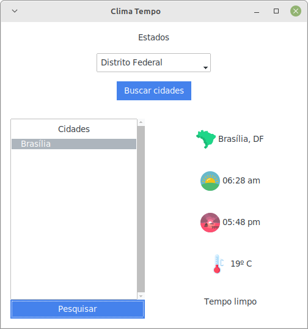

# ClimaTempo

<br>

## instalação
1. clonando o reposito `git clonehttps://github.com/nbilbo/climatempo.git`
2. movendo para o diretorio do projeto `cd ./climatempo` 
3. criando um novo ambiente virtual `python3 -m venv venv`
4. ativando o ambiente virtual `source ./venv/bin/activate`
5. instalando as dependencias `python -m pip install -r requirements.txt`
---

<br>

## comandos (**lembre de estar com o ambiente virtual ativo**).

* Conferindo a temperatura.
```
python main.py clima --cidade "Brasilia" --estado "DF"
```
```
**********
Cidade               Brasília, DF
Nascer do sol        06:28 am
Por do sol           05:48 pm
Temperaratura        19º C
Descricao            Tempo limpo
**********
```

<br>

* Interface grafica de usuario.
```
python main.py gui
```


<br>

* Help.
```
python main.py --help
```

```
python main.py clima --help
```
---

<br>

## FAQ

* Como funciona? 
    * Utilizando [Web Scraping](https://en.wikipedia.org/wiki/Web_scraping).
* Todas as cidades estão disponiveis?
    * Não, em alguns casos não é possivel realizar a consulta.